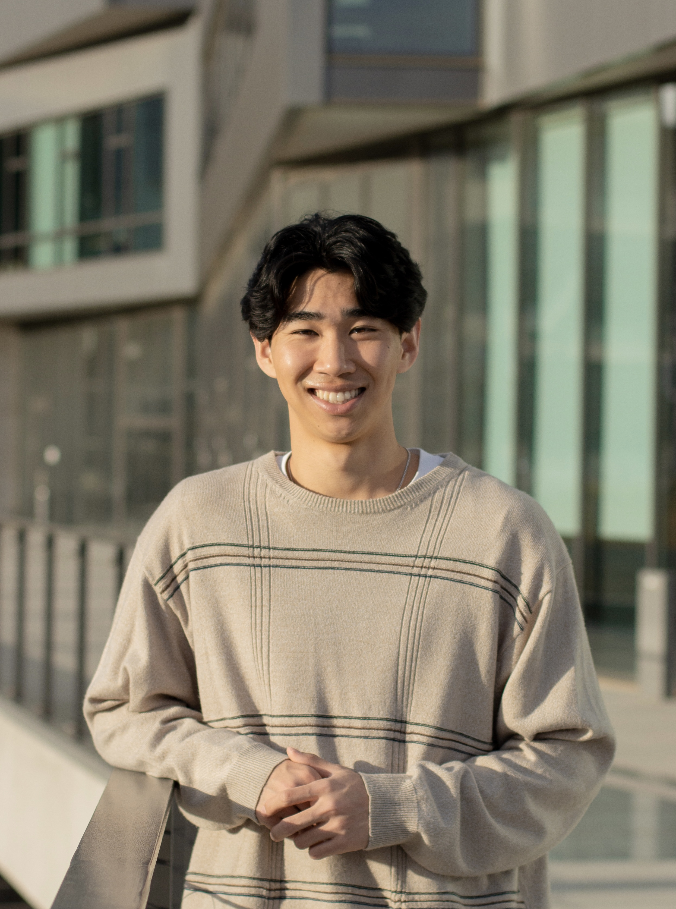

# CSE 110 Lab 1 - Justin's User Page

## Introduction

Hello, my name is **Justin Chiang**.

> I'm a Second year Computer Science student at UC San Diego!

Here's a picture of me!

## Programming

I'm constantly forgetting how to use `git`, so this lab has been a great review for me.

The programming languages I'm most comfortable in are:
1. Java
2. Python
3. Javascript

My GitHub can be accessed [here](https://github.com/justin-chiang).

You can view the README of this lab [here](README.md).

## Hobbies

Some of my favorite hobbies include:
- Playing volleyball and soccer
- Learning fingerstyle guitar
- Thrifting and second-hand fashion

And some activities that I'm currently learning or planning to in the future:
- [x] Reading practical self-help books
- [ ] Surfing with friends!
- [ ] Learning how to dance